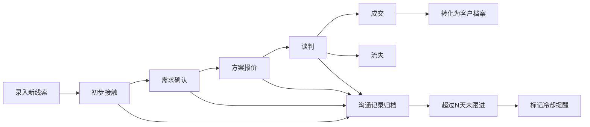

## 1. 产品概述

销售线索管理与跟进系统（轻量级CRM），面向中小企业销售团队，解决销售线索分散、跟进不及时、转化率难以量化的痛点。通过看板化管理、自动提醒和数据分析，帮助销售团队高效跟进客户、提升成交率。

- 目标用户：销售人员、销售经理
- 核心价值：线索全生命周期管理、跟进动作可视化、销售漏斗数据分析

## 2. 核心功能

### 2.1 用户角色

| 角色 | 核心权限 |
|------|----------|
| 销售人员 | 录入/编辑个人线索、记录沟通、推进阶段、转化客户 |
| 销售经理 | 查看全团队线索、数据分析报表、设定销售目标、接收重要变动通知 |

### 2.2 功能模块

1. **仪表盘首页**：今日待跟进线索、本月销售目标进度、关键指标概览
2. **线索看板页**：按销售阶段展示的拖拽式看板、线索筛选与搜索
3. **线索详情页**：客户基本信息、沟通时间线、阶段推进记录
4. **客户档案页**：已转化客户列表、档案详情、历史沟通记录
5. **数据分析页**：漏斗转化率、各阶段停留时长、成交周期分布
6. **销售目标页**：目标设定、月度进度追踪、团队成员排名
7. **通知中心**：冷却提醒、重要线索变动通知

### 2.3 页面详情

| 页面名称 | 模块名称 | 功能描述 |
|-----------|-------------|---------------------|
| 仪表盘首页 | 今日待跟进 | 展示超过N天未跟进的"冷却"线索，一键跳转跟进 |
| 仪表盘首页 | 目标进度卡片 | 本月成交金额/数量目标及达成率环形图 |
| 仪表盘首页 | 关键指标 | 新增线索数、跟进次数、转化率等核心KPI |
| 线索看板页 | 阶段列 | 初步接触/需求确认/方案报价/谈判/成交/流失 六列看板 |
| 线索看板页 | 线索卡片 | 显示客户名称、来源渠道、负责人、最近跟进时间、冷却标记 |
| 线索看板页 | 拖拽操作 | 拖拽卡片切换销售阶段，自动记录阶段变更时间 |
| 线索看板页 | 新建线索 | 弹窗表单录入客户信息、来源渠道、初始阶段 |
| 线索详情页 | 客户信息 | 公司名、联系人、职位、电话、邮箱、地址、来源渠道 |
| 线索详情页 | 沟通时间线 | 按时间倒序展示电话/邮件/拜访记录，支持新增沟通 |
| 线索详情页 | 阶段历史 | 展示各阶段进入/离开时间、停留时长 |
| 线索详情页 | 转化操作 | 一键转化为正式客户档案 |
| 客户档案页 | 客户列表 | 已转化客户表格，支持搜索筛选 |
| 客户档案页 | 客户详情 | 客户基本信息 + 从线索迁移过来的完整沟通历史 |
| 数据分析页 | 漏斗转化率 | 各阶段线索数量及向下转化率柱状图 |
| 数据分析页 | 阶段停留时长 | 箱线图展示各阶段平均/中位数停留天数 |
| 数据分析页 | 成交周期分布 | 直方图展示从初步接触到成交的天数分布 |
| 销售目标页 | 目标设定 | 设置月度成交金额/数量目标，可按人员分配 |
| 销售目标页 | 进度追踪 | 进度条展示各人/团队目标达成率 |
| 通知中心 | 冷却提醒 | 列表展示需跟进的冷却线索及未跟进天数 |
| 通知中心 | 变动通知 | 阶段推进/丢单的实时消息，关联线索及操作人 |

## 3. 核心流程

### 线索跟进与转化流程
销售人员录入新线索 → 在看板中推进阶段 → 每次沟通记录到时间线 → 系统自动监控跟进频率 → 超期未跟进标记冷却 → 最终成交转化为客户或标记流失。

## 4. 用户界面设计

### 4.1 设计风格
- 主色调：深海军蓝 #0F2747，搭配商务蓝 #2563EB 作为强调色
- 辅助色：成功绿 #10B981、警告橙 #F59E0B、危险红 #EF4444、冷却紫 #8B5CF6
- 中性色：以 Slate 色系为基础，保证数据可读性
- 字体：展示字体使用 "Plus Jakarta Sans"，正文字体使用 "Inter"
- 按钮风格：圆角8px，主按钮填充商务蓝带细微阴影
- 布局风格：左侧导航栏 + 顶部面包屑 + 主内容卡片式布局
- 图标：使用 Lucide React 线性图标风格

### 4.2 页面设计概述

| 页面名称 | 模块名称 | UI元素 |
|-----------|-------------|-------------|
| 仪表盘首页 | 指标卡片 | 渐变背景卡片 + 大号数字 + 环比趋势箭头 |
| 线索看板页 | 阶段列 | 列标题带计数徽章、卡片间隙8px、列底色微差异 |
| 线索看板页 | 线索卡片 | 阴影+悬停抬升效果、冷却线索紫色边框高亮 |
| 线索详情页 | 时间线 | 左侧竖线时间轴、不同沟通类型用不同颜色图标区分 |
| 数据分析页 | 漏斗图 | 渐变色梯形漏斗、标注阶段名称和转化率百分比 |
| 销售目标页 | 进度条 | 分段渐变进度条、末端显示达成百分比 |

### 4.3 响应式
- 桌面端优先设计，最小支持宽度 1280px
- 看板在窄屏自动切换为垂直堆叠布局
- 侧边栏在平板尺寸可折叠收起
