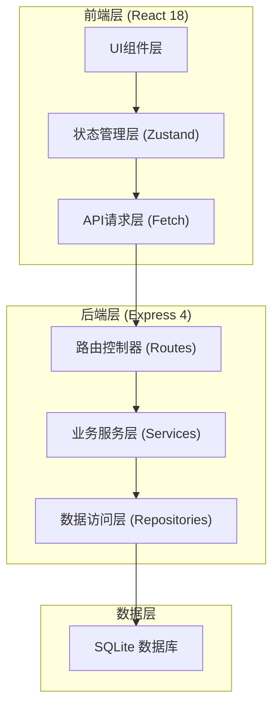
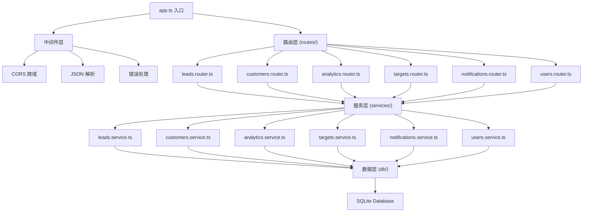
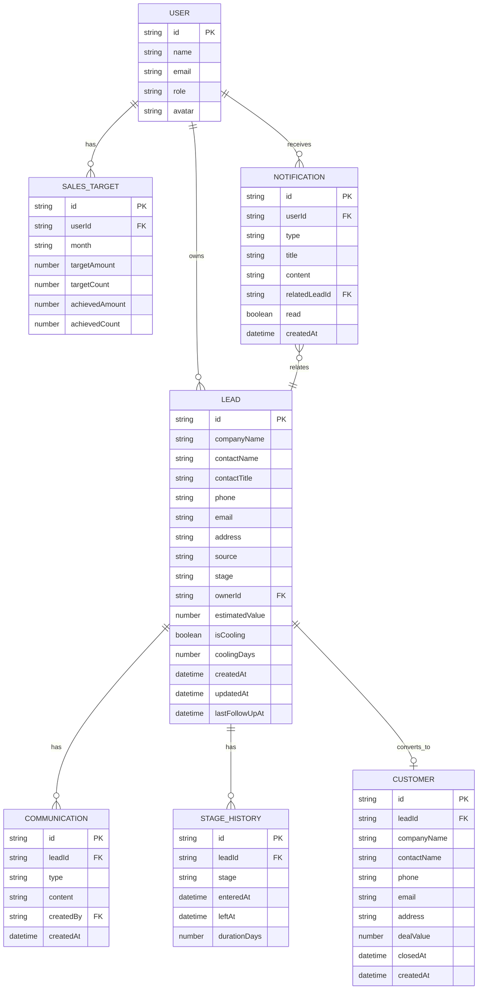

## 1. 架构设计



## 2. 技术描述

- 前端：React@18 + TypeScript + Tailwind CSS@3 + Vite
- 后端：Express@4 + TypeScript
- 状态管理：Zustand
- 路由：React Router DOM
- 图表：Recharts
- 拖拽：@dnd-kit/core + @dnd-kit/sortable
- 图标：Lucide React
- 数据库：SQLite + better-sqlite3
- 初始化工具：vite-init react-express-ts 模板

## 3. 路由定义

| 前端路由 | 页面组件 | 用途 |
|----------|----------|------|
| / | Dashboard | 仪表盘首页 |
| /leads | LeadBoard | 线索看板页 |
| /leads/:id | LeadDetail | 线索详情页 |
| /customers | CustomerList | 客户档案列表 |
| /customers/:id | CustomerDetail | 客户档案详情 |
| /analytics | Analytics | 数据分析报表 |
| /targets | SalesTargets | 销售目标管理 |
| /notifications | Notifications | 通知中心 |

## 4. API 定义

### 4.1 TypeScript 类型定义

```typescript
type LeadStage = 'initial' | 'needs' | 'proposal' | 'negotiation' | 'won' | 'lost';
type LeadSource = 'website' | 'expo' | 'referral';
type CommunicationType = 'phone' | 'email' | 'visit';
type UserRole = 'sales' | 'manager';

interface User {
  id: string;
  name: string;
  email: string;
  role: UserRole;
  avatar?: string;
}

interface Lead {
  id: string;
  companyName: string;
  contactName: string;
  contactTitle?: string;
  phone: string;
  email: string;
  address?: string;
  source: LeadSource;
  stage: LeadStage;
  ownerId: string;
  estimatedValue: number;
  isCooling: boolean;
  coolingDays: number;
  createdAt: string;
  updatedAt: string;
  lastFollowUpAt?: string;
}

interface Communication {
  id: string;
  leadId: string;
  type: CommunicationType;
  content: string;
  createdBy: string;
  createdAt: string;
}

interface StageHistory {
  id: string;
  leadId: string;
  stage: LeadStage;
  enteredAt: string;
  leftAt?: string;
  durationDays?: number;
}

interface Customer {
  id: string;
  leadId: string;
  companyName: string;
  contactName: string;
  phone: string;
  email: string;
  address?: string;
  dealValue: number;
  closedAt: string;
  createdAt: string;
}

interface SalesTarget {
  id: string;
  userId: string;
  month: string;
  targetAmount: number;
  targetCount: number;
  achievedAmount: number;
  achievedCount: number;
}

interface Notification {
  id: string;
  userId: string;
  type: 'cooling' | 'stage_change' | 'lost';
  title: string;
  content: string;
  relatedLeadId?: string;
  read: boolean;
  createdAt: string;
}
```

### 4.2 REST API 端点

| 方法 | 路径 | 用途 |
|------|------|------|
| GET | /api/users | 获取用户列表 |
| GET | /api/leads | 获取线索列表（支持筛选） |
| GET | /api/leads/:id | 获取线索详情 |
| POST | /api/leads | 创建新线索 |
| PUT | /api/leads/:id | 更新线索信息 |
| PATCH | /api/leads/:id/stage | 变更线索阶段 |
| POST | /api/leads/:id/convert | 线索转化为客户 |
| GET | /api/leads/:id/communications | 获取沟通记录 |
| POST | /api/leads/:id/communications | 新增沟通记录 |
| GET | /api/leads/:id/stage-history | 获取阶段历史 |
| GET | /api/customers | 获取客户列表 |
| GET | /api/customers/:id | 获取客户详情 |
| GET | /api/analytics/funnel | 获取漏斗转化率数据 |
| GET | /api/analytics/stage-duration | 获取阶段停留时长数据 |
| GET | /api/analytics/close-cycle | 获取成交周期分布数据 |
| GET | /api/targets | 获取销售目标列表 |
| POST | /api/targets | 创建销售目标 |
| PUT | /api/targets/:id | 更新销售目标 |
| GET | /api/notifications | 获取当前用户通知 |
| PATCH | /api/notifications/:id/read | 标记通知已读 |
| GET | /api/notifications/unread-count | 获取未读通知数量 |

## 5. 服务器架构图



## 6. 数据模型

### 6.1 ER 图



### 6.2 数据库初始化

使用 SQLite，通过 better-sqlite3 在服务启动时自动建表并插入 Mock 数据。建表 SQL 包含所有实体表及必要索引（ownerId、stage、createdAt、leadId）以保证查询性能。
